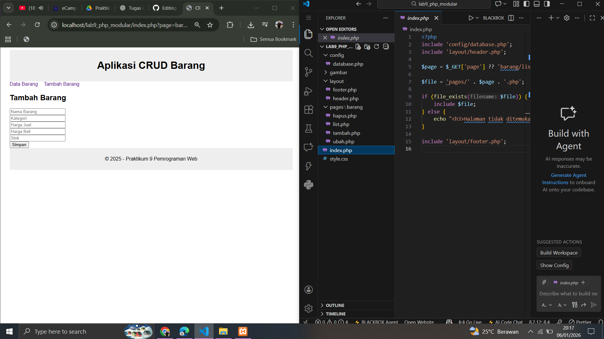
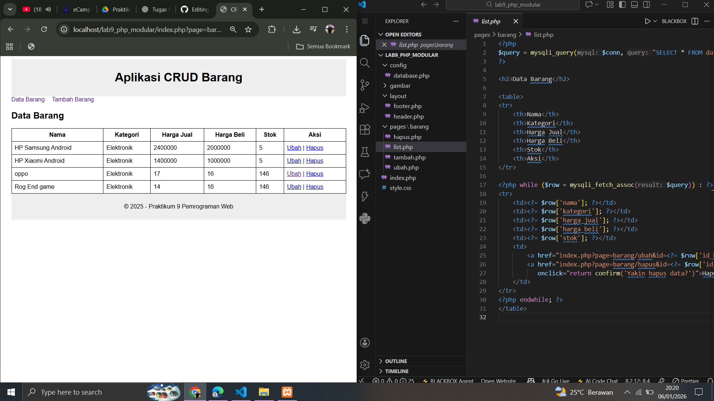
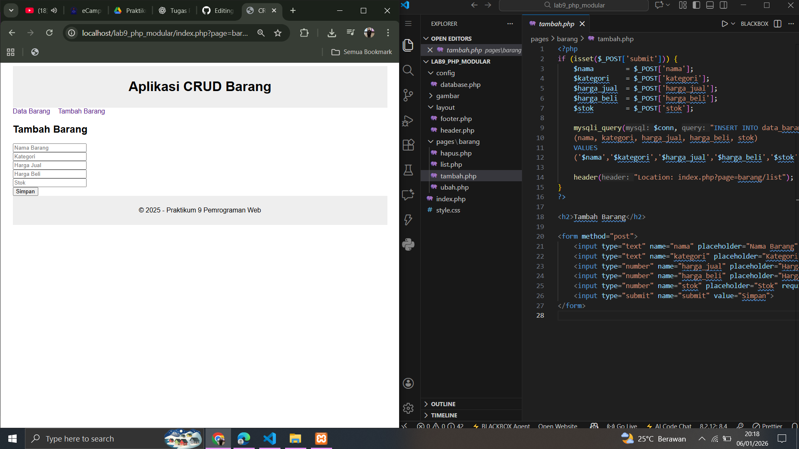
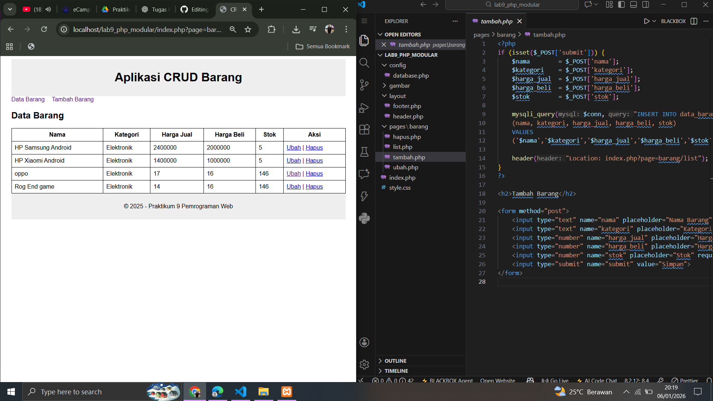
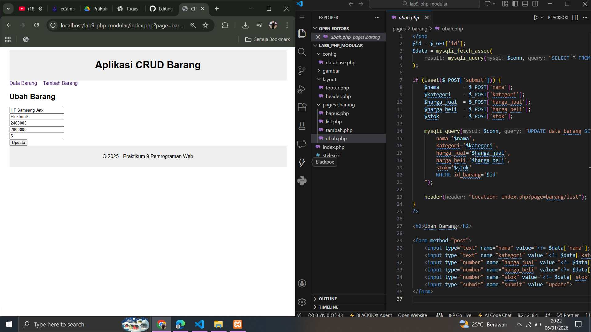
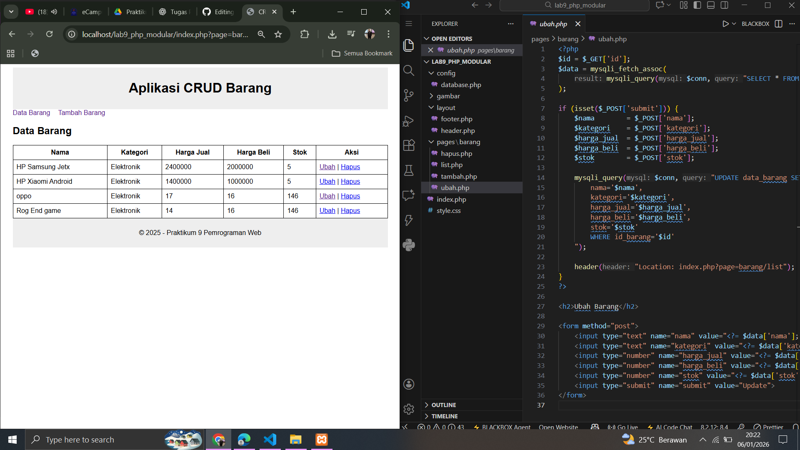
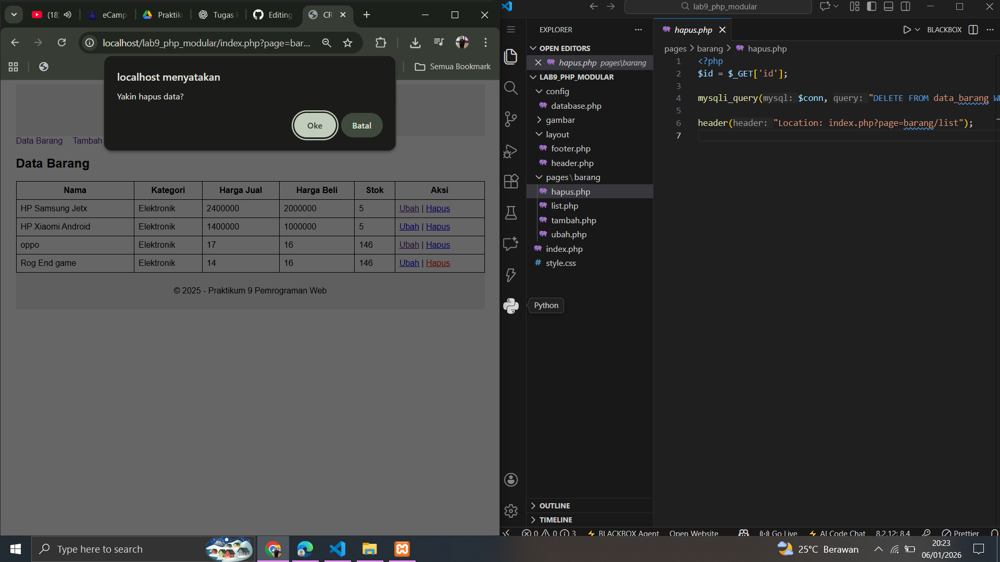

# Lab9web
Nama: Den Fahmi Satria <p>
Nim: 312410523 <p>
Kelas: TI.24.A5 <p>
# Praktikum 9 – PHP Modular dan Routing

## Deskripsi
Praktikum 9 merupakan lanjutan dari Praktikum 8 dengan tujuan menerapkan **konsep modularisasi** dan **routing** pada aplikasi CRUD berbasis PHP dan MySQL.  
Setiap halaman menggunakan template yang sama dan pengaturan halaman dilakukan melalui satu file routing.

## Struktur File Utama

```
lab9_php_modular/
│
├── config/
│ └── database.php
│
├── layout/
│ ├── header.php
│ └── footer.php
│
├── pages/
│ └── barang/
│ ├── list.php
│ ├── tambah.php
│ ├── ubah.php
│ └── hapus.php
│
├── index.php
└── style.css
```

## Penjelasan File

### 1. index.php
File **index.php** berfungsi sebagai **router utama**.  
Routing dilakukan menggunakan parameter **page** pada URL untuk menentukan halaman yang akan ditampilkan.
 <p>
### 2. list.php
File **list.php** digunakan untuk **menampilkan seluruh data barang** yang tersimpan di database dalam bentuk tabel.  
Pada halaman ini juga tersedia aksi untuk mengubah dan menghapus data.
 <p>
### 3. tambah.php
File **tambah.php** digunakan untuk **menambahkan data barang baru** ke dalam database melalui form input.  
Setelah data berhasil disimpan, halaman akan diarahkan kembali ke halaman list.
 <p>
 <p>
### 4. ubah.php
File **ubah.php** digunakan untuk **mengubah data barang** yang sudah ada berdasarkan ID yang dipilih.  
Data lama ditampilkan terlebih dahulu di dalam form sebelum dilakukan perubahan.
 <p>
 <p>
### 5. hapus.php
File **hapus.php** digunakan untuk **menghapus data barang** dari database berdasarkan ID.  
Setelah data dihapus, halaman akan diarahkan kembali ke halaman list.
 <p>
## Kesimpulan
Dengan penerapan modularisasi dan routing, aplikasi CRUD menjadi lebih terstruktur dan mudah dikelola.  
Penggunaan satu file routing memudahkan pengaturan halaman dan meningkatkan keteraturan kode program.
